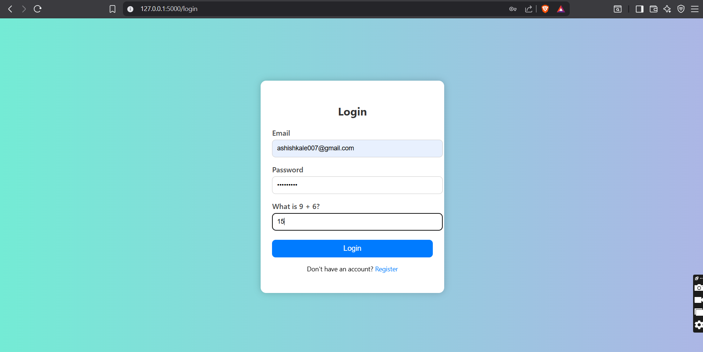

# Secure Login System (Flask + SQLite)

##  Project Overview

This is a secure login system built using Flask and SQLite. It supports user registration, login, role-based access for Admin and Users, and key security features like input validation, CAPTCHA, account lockout, and admin unlock functionality.

##  Features

- User Registration & Login
- Admin & User Role Management
- Admin Dashboard to View, Delete, or Unlock Users
- Input Validation and SQL Injection Protection
- CAPTCHA for Brute Force Protection
- Account Lockout after 3 Failed Attempts
- Session Management and Logout


## ⚙ Setup Instructions

```bash
1. Clone the repo:
   git clone https://github.com/rohankale111/secure-login-system.git

2. Navigate to the backend directory:
   cd secure-login-system/backend

3. Create a virtual environment:
   python -m venv venv

4. Activate it:
   venv\Scripts\activate   # (on Windows)

5. Install dependencies:
   pip install -r requirements.txt

6. Run the app:
   python app.py


##  Screenshots

Here are some screenshots of the system in action:

- 
- 
- 
- 
- 
- 
- 
- 


##  Challenges & Solutions

**Problem:** Multiple databases being created.  
**Solution:** Used absolute paths in `init_db()` and `get_db_connection()`.

**Problem:** Flash messages were reappearing on page reload.  
**Solution:** Cleared them using `session.pop('_flashes', None)`.

**Problem:** SQL Injection / Invalid Input  
**Solution:** Input validation + parameterized queries.

**Problem:** CAPTCHA wasn’t blocking bots  
**Solution:** Made CAPTCHA mandatory before login.

**Problem:** Duplicate email registration  
**Solution:** Checked email before allowing registration.
